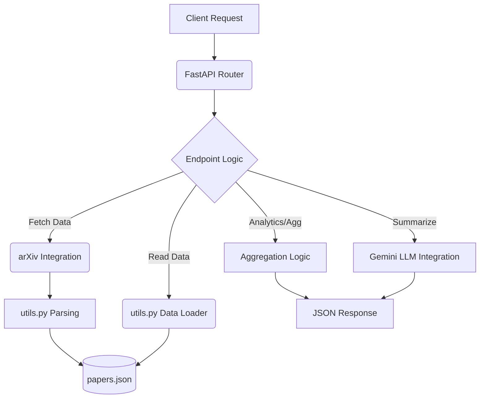

# ResearchIQ Architecture Overview

## Backend Architecture

ResearchIQ is a research analytics system built with a modern, lightweight Python stack:

1.  **FastAPI Core Engine**
    - High-performance asynchronous endpoint routing.
    - Automatic request/response validation via Pydantic.
    - Built-in Swagger UI documentation (`/docs`).

2.  **Modular Utility Layer (`backend/utils.py`)**
    - Abstracts file I/O operations safely (`load_papers`, `save_papers`).
    - Handles external API parsing (e.g., `parse_arxiv_entry`).
    - Implements data validation to ensure schema consistency.
    - Manages advanced logic such as LLM-based abstract summarization with API key rotation (Gemini 2.5 Flash/Pro).

3.  **Local Storage Layer (`backend/data/papers.json`)**
    - The current persistence layer uses a local JSON file.
    - Abstracted behind `utils.py` to allow seamless future migration to PostgreSQL or a Vector DB (like Pinecone) without modifying core endpoint logic.
    - Deduplication logic ensures unique paper ingestion.

4.  **Analytics Layer (`backend/main.py`)**
    - Contains endpoints that aggregate and filter the stored dataset.
    - Exposes trends (yearly counts, top keywords) and semantic searches (LLM summaries).

## System Data Flow

